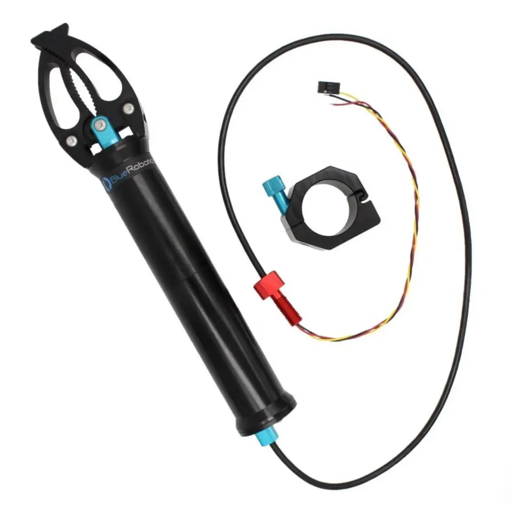
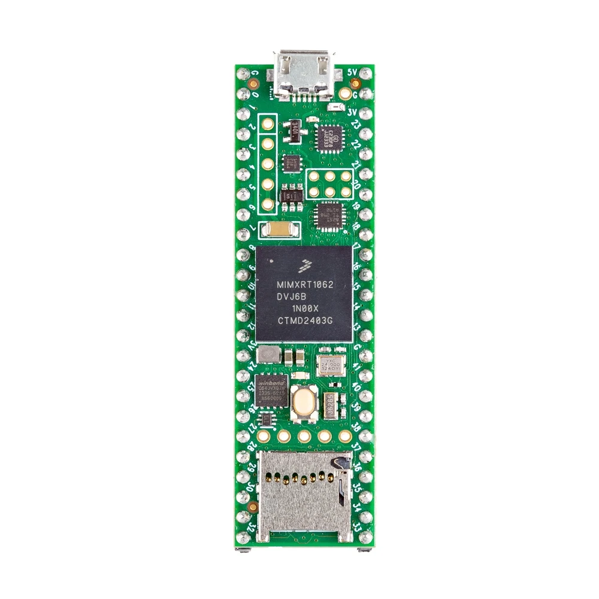
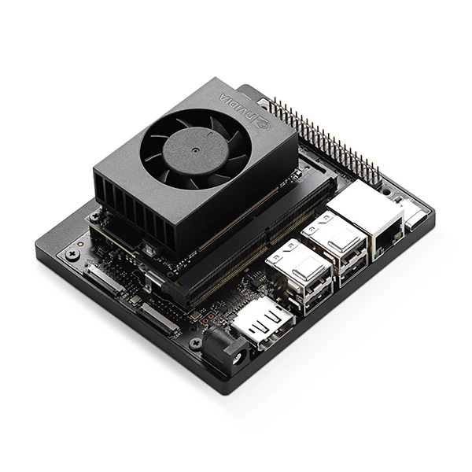
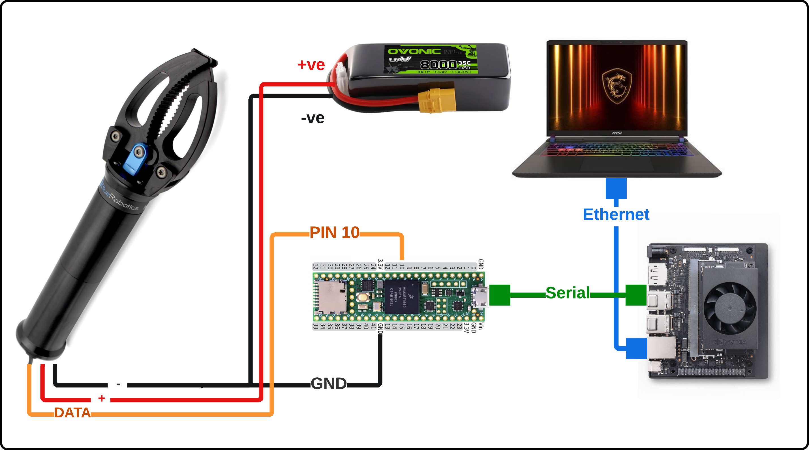
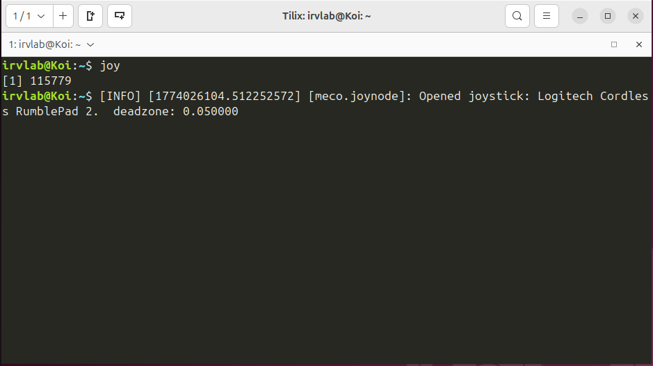
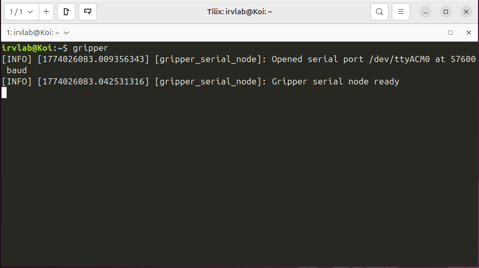

# Newton Subsea Gripper — Joystick Control ROS2 Package

A serial control node for the [Blue Robotics Newton Subsea Gripper](https://bluerobotics.com/store/thrusters/grippers/newton-gripper-asm-r2-rp/). The node runs on a [Jetson Orin Nano](https://www.seeedstudio.com/NVIDIAr-Jetson-Orintm-Nano-Developer-Kit-p-5617.html), subscribes to `meco/joy` published from a [laptop](LINK_TO_LAPTOP_PAGE) running Ubuntu 24.04, and forwards open/close commands over USB serial to a [Teensy 4.1](https://www.adafruit.com/product/4622) which outputs the corresponding PWM signal to the gripper.

> Note: this package assumes a node reading and publishing the joystick inputs already exists. An alias `joy`spawns the node. in the `irvlab` machines, this alias already exists. 

<table>
  <tr>
    <td align="center" width="25%">
      <a href="https://bluerobotics.com/store/thrusters/grippers/newton-gripper-asm-r2-rp/">
        
      </a>
      <br/><em>Blue Robotics Newton Subsea Gripper</em>
    </td>
    <td align="center" width="25%">
      <a href="https://www.adafruit.com/product/4622">
        
      </a>
      <br/><em>PRJC Teensy 4.1 Microcontroller</em>
    </td>
    <td align="center" width="25%">
      <a href="https://www.seeedstudio.com/NVIDIAr-Jetson-Orintm-Nano-Developer-Kit-p-5617.html">
        
      </a>
      <br/><em>Jetson Series of Devices (AGX/Orin/Nano)</em>
    </td>
    <td align="center" width="25%">
      <a href="LINK_TO_LAPTOP_PAGE">
        
      </a>
      <br/><em>Laptop Running Ubuntu 24.04</em>
    </td>
  </tr>
</table>
<p align="center"><em>List of components required for the system.</em></p>

---

## System Schematic

The Newton Gripper is powered directly from the 4S (16v) LiPo battery, with a shared ground between the battery, gripper, and Teensy. The Teensy outputs a PWM signal from Pin 10 to the gripper's signal wire to control motion. It communicates with the Jetson Orin Nano over USB serial, through which the ROS2 node sends commands. The Jetson and laptop are linked over Ethernet, allowing ROS2 topics ```meco/joy``` to be shared between machines.



<p align="center"><em>System schematic showing wiring between devices.</em></p>


---

## ROS2 Package Structure

```
ros2_ws_gripper/
└── src/
    └── gripper/
        ├── gripper/
        │   ├── __init__.py
        │   └── gripper_serial_node.py
        ├── resource/
        │   └── gripper
        ├── package.xml
        ├── setup.py
        └── setup.cfg
```

> You will need to set up this package in the machine connected to the teensy. Any device capable of running ROS2 will work.

---

## Dependencies

### System Dependencies
- ROS2 (Humble/Jazzy)
- Python 3
- python3-serial

```bash
sudo apt install python3-serial
```

### ROS2 Dependencies
- rclpy
- sensor_msgs

---

## Building the Package

### First Time Setup

```bash
# Navigate to workspace
cd ~/ros2_ws_gripper

# Install dependencies
rosdep install --from-paths src --ignore-src -r -y

# Source ROS2
source /opt/ros/humble/setup.bash

# Build the package
colcon build --packages-select gripper

# Source the workspace
source install/setup.bash
```

### Rebuilding After Changes

```bash
cd ~/ros2_ws_gripper

# Clean build (recommended after major changes)
rm -rf build/ install/ log/
colcon build --packages-select gripper

# Or incremental build
colcon build --packages-select gripper

# Source the workspace
source install/setup.bash
```

### Permanently Source the Workspace

```bash
echo "source ~/ros2_ws_gripper/install/setup.bash" >> ~/.bashrc
source ~/.bashrc
```

---

## Running the Nodes

Using the following commands in new terminal on the jetson to start the node. 

```bash
source ~/ros2_ws_gripper/install/setup.bash
ros2 run gripper gripper_serial_node
```

### Set Up the Alias (Recommended)

Add the following to your `~/.bashrc`:

```bash
alias gripper='source ~/ros2_ws_gripper/install/setup.bash && ros2 run gripper gripper_serial_node'
```

Apply it:

```bash
source ~/.bashrc
```

### Step 1 — Launch the Joystick Node

In a **separate terminal** on the laptop, run:

```bash
joy
```



<p align="center"><em>Joystick node publishing to <code>meco/joy</code>.</em></p>

### Step 2 — Launch the Gripper Node on the Jetson or Laptop

Launch using the alias created:

```bash
gripper
```



<p align="center"><em>Gripper node connected to the Teensy over serial.</em></p>

### Overriding Serial Port or Baud Rate

```bash
ros2 run gripper gripper_serial_node --ros-args -p serial_port:=/dev/ttyACM1 -p baud_rate:=57600
```

---

## Button Mapping

| Button Index | Action |
|---|---|
| `OPEN_BUTTON` (default: `11`) | Opens the gripper while held |
| `CLOSE_BUTTON` (default: `10`) | Closes the gripper while held |
| Neither pressed | Gripper stops (neutral / 1500µs) |

To find the correct indices for your controller:

```bash
ros2 topic echo meco/joy
```

Press each button and note which index in the `buttons` array changes to `1`. Update `OPEN_BUTTON` and `CLOSE_BUTTON` in `gripper/gripper_serial_node.py` accordingly.

---

## Teensy Serial Protocol

The Teensy listens for single-character commands over USB serial at 57600 baud:

| Command | Action |
|---|---|
| `O` | Open gripper (1100µs PWM) |
| `C` | Close gripper (1900µs PWM) |
| `S` | Stop / neutral (1500µs PWM) |

> Note: Stop is currently disabled. 

---

## Troubleshooting

Serial port permission denied
```bash
sudo usermod -aG dialout $USER
# Log out and back in for this to take effect
```

Find the Teensy's port
```bash
ls /dev/ttyACM*
# or
dmesg | tail
```

Monitor serial commands being sent to the Teensy
```bash
# Stop the gripper node first, then:
stty -F /dev/ttyACM0 57600 && cat /dev/ttyACM0
```

Package not found
```bash
# Make sure you sourced the workspace
source ~/ros2_ws_gripper/install/setup.bash

# Check if package is built
ros2 pkg list | grep gripper
```

Node is running but gripper is not responding
```bash
# Confirm joy messages are flowing and check button indices
ros2 topic echo meco/joy

# Check the node is subscribed
ros2 node info /gripper_serial_node
```

---
